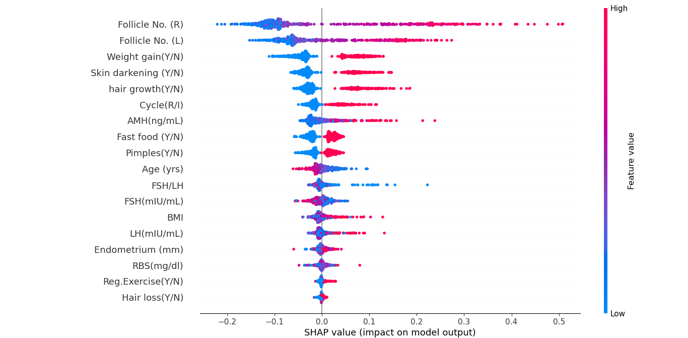

# ShePredicts 💫  
An explainable AI model for early detection of PCOS, designed with care and clarity.

---

## 🧠 What is ShePredicts?

**ShePredicts** is a machine learning project that helps predict Polycystic Ovary Syndrome (PCOS) using clinical, lifestyle, and hormonal features.  
It’s not just accurate — it’s also transparent, thanks to **SHAP explainability**.

This tool is built to support early awareness, assist healthcare researchers, and contribute to more accessible women’s health solutions.

---

## ✨ Features

- ✅ Predicts PCOS using Random Forest Classifier
- 📊 SHAP summary plot and force plots for individual explanation
- 📁 Clean and reusable pipeline: from preprocessing to training to interpretability
- 🧠 Based on real-world medical data


---

## 🛠️ Technologies Used

- Python 3.10  
- pandas, scikit-learn  
- SHAP (SHapley Additive exPlanations)  
- matplotlib + HTML visualizations  
- joblib for model serialization

---

## 📦 Folder Structure (Core Files)

```
ShePredicts/
│
├── model/
│   └── pcos_random_forest_model.pkl  ← Trained model (saved with joblib)
│
├── shap_outputs/
│   ├── shap_summary_pcos.png         ← Global SHAP summary
│   └── force_plot_patientX.html      ← Interactive per-patient force plots
│
├── cleaning_data.py                  ← Handles missing values + outliers
├── preprocessing_data.py             ← Fixes binary/label formats
├── select_features.py                ← Feature selection script
├── training_model.py                 ← Training + evaluation script
├── shap_explainer.py                 ← Generates SHAP values & summary
├── shap_force_plot.py                ← Exports 5 individual force plots
└── README.md                         ← This file
└── PCOS_final_dataset.csv            ← Cleaned, preprocessed dataset
```

---

## 📈 Real-World Impact

polycystic ovarian syndrome, is the most common endocrine disorder in women of reproductive age and everybody especially we as women need to raise our awareness about this issue.

This project helps:

- Boost **early awareness** through simple ML predictions  
- Provide **explainable decisions** with SHAP visualizations  
- Encourage more ethical and transparent AI in healthcare

---

## ⚡ Model Performance

The trained Random Forest Classifier reached an **accuracy of 89%** on unseen test data.  
The SHAP summary highlighted features like **LH, FSH, AMH**, and **Follicle Count** as key influencers — aligning with clinical intuition.


---

## 🔍 Example Visuals

### SHAP Summary Plot  


### Force Plot Example  
Interactive HTML visualizations are available in `shap_outputs/`.  
You can open them in your browser — here’s a quick look:  
<a href="shap_outputs/force_plot_patient0.html">🧬 Force Plot: Patient 0</a>

---
---

## 🚧 Challenges Faced

- Cleaning noisy real-world medical data with missing values and inconsistent labels  
- Handling column with unexpected values (e.g., Cycle(R/I) → 2 & 4 🤨)
- Avoiding black-box predictions with SHAP  
- Organizing the repo *after a chaotic first upload* 😅 (seriously learn my lesson to be organised from the first step 🚶🏻‍♀️)

---

## 💗 Final Notes

I didn’t just want to make “another model.”  
I wanted to build something respectful, responsible, and *relatable*.  
**ShePredicts** was built with genuine curiosity, many mistakes, and a bit of pink energy.

> “If we want AI to help people, it has to speak human too.”

---

## ✍️ Built By

Made with science and softness  
by [Paria](https://github.com/buildwithparia) —  
Future AI researcher, current overthinker 💭✨
